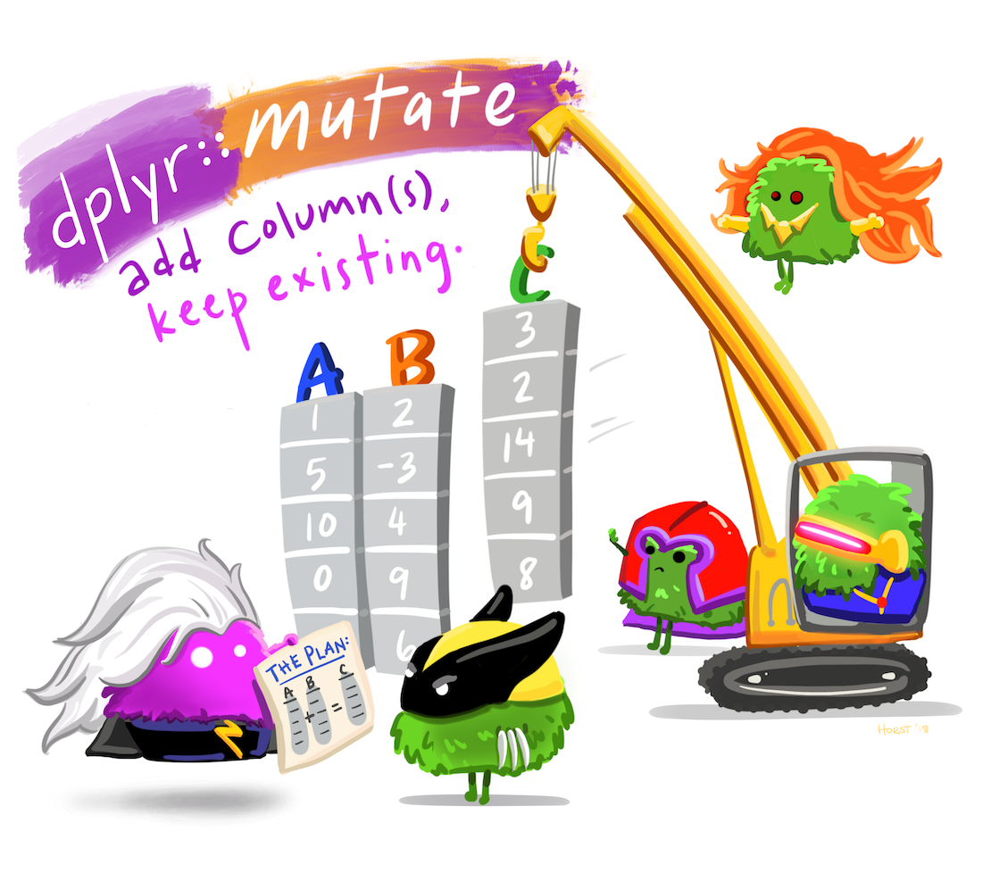

Activity 6: Data wrangling 1: rows and columns
================

# Overview

Welcome! Today’s activity introduces “data wrangling,” a key skill that
allows scientists to explore their data, get it in the right format, run
calculations, and in general have tidy data and code. This activity
introduces a handful of functions in the `dplyr` package including:
`select()`, `filter()`, and `mutate()`, which will allow you to modify
data frames in a wide variety of useful ways, such as trimming down
columns or rows to include specific values or adding new columns that
are the outputs of calculations using previous columns.

You will submit two outputs for this activity:

1.  A **PDF** of a rendered Quarto document with all of your R code.
    Please create a new Quarto document (e.g. don’t use this
    `README.qmd`), include all of the code that appears in this
    document, in addition to adding your own code and **answers to all
    of the questions** in the “Q#” sections.

2.  A plot and your answers from the final “bison” section. Submit that
    content to the google slide below:

<https://docs.google.com/presentation/d/1f7wh7h0oMh2CSHniOsRMhhCxXbmDzsGp3UpqSQSQXgc/edit?usp=sharing>

*If you have trouble submitting as a PDF, please ask Calvin or Malin for
help. If we still can’t solve it, you can submit the .qmd file instead.*

A reminder: **Please label the code** in your final submission in two
ways: 1) denote your answers to each question using headers that
correspond to the question you’re answering and 2) thoroughly “comment”
your code: remember, this means annotating your code directly by typing
descriptions of what each line does after a `#`. This will help future
you!

# 1. Cereal!

## 1.1 Introducing tidyverse and the pipeline: `%>%` / `|>`


We are going to be using a package called `dplyr` which comes from a
suite of packages known as the `tidyverse`. `ggplot2`, which we worked a
lot with last week, is also a `tidyverse` package! This suite of
packages was developed to make coding in R intuitive and accessible,
which hopeful will make you feel not like this…


But instead like this! (Artwork by @allison_horst)


If you haven’t already, install all tidyverse packages using:
`install.packages("tidyverse)` and then delete that line (no need to
reinstall every time). Next, load in the packages. This will list all of
the packages as well as any “conflicting” functions (when multiple
packages have different functions of the same name - don’t worry about
this!).

``` r
## Load packages from library
library("tidyverse")
library(here)
```

------------------------------------------------------------------------

Now that we have our packages installed, let’s introduce the pipeline
`%>%` or `|>`.

There are two pipeline operators: `%>%` or `|>`. The first one is older
and comes with one of the `tidyverse` packages, whereas the `|>` is new
and built into base R: no packages needed! They are basically equivalent
though: I will use and refer to `%>%` in this lesson. **The keyboard
shortcut for `%>%` is `Control + Shift + M` or `Command + Shift + M`
(Macs)** but you can switch that to be `|>` (see this link:
<https://stackoverflow.com/questions/68667933/how-to-fast-insert-new-pipe-operator-in-rstudio>)

The `%>%` operator let’s us string together multiple functions at once.
This can be particularly useful when dealing with data that we need to
apply lots of functions to!

To demonstrate, let’s start simple with vectors. Create a vector of
fruit names:

``` r
fruits <- c("apple", "apple", "orange", "orange", "banana")
```

Our goal is to apply two functions, `unique()` and `length()`, to output
the number of unique fruits in this vector. We can tell that it is 3,
but with larger and larger vectors (and columns) of data, this is harder
to immediately tell.

We can look at the unique fruits here: The `unique()` function, which
we’ve used a couple times previously, takes a vector and returns only
unique elements of it: **this creates a new vector as output**. This new
vector is `"apple" "orange" "banana"`.

``` r
unique(fruits)
```

    [1] "apple"  "orange" "banana"

Our goal is to apply the `length()` function to the output of the
`unique()` function. Two (slightly messy) options could be to:

1.  Nest the functions together
2.  Create an intermediate data object that hosts the output of the
    `unique()` function

``` r
# 1) Nest the unique function within the length function
length(unique(fruits))
```

    [1] 3

``` r
# 2) Create intermediate data objects
unique.fruits <- unique(fruits)
length(unique.fruits)
```

    [1] 3

*However*, both of these methods are a little messy when you start
applying more and more functions at once; in the first, those are a lot
of parentheses to keep track of, and in the second, you might end up
with lots of unnecessary data objects.

The pipeline (`%>%)` helps here, and operates by *taking the data object
that it sees behind it and throwing it into the next function it sees*:

``` r
# for instance:
fruits %>% unique()
```

    [1] "apple"  "orange" "banana"

``` r
# is the same as:
unique(fruits)
```

    [1] "apple"  "orange" "banana"

This makes stringing functions together super nice: the following code
takes the “fruits” object and 1) feeds it into the unique() function. 2)
This produces an output, which the second pipe takes and feeds into the
length() function.

``` r
# Piping!
fruits %>% unique() %>% length()
```

    [1] 3

This method can also be done neatly while spread across multiple lines,
just like how the `+` allows us to continue layering functions in
`ggplot()`.

``` r
fruits %>% 
  unique() %>% 
  length()
```

    [1] 3

------------------------------------------------------------------------

## 1.2 Import data, apply the pipeline

Read in the `cereal.csv` dataframe using the `read_csv()` function
(slightly different from the `read.csv()` function in that it
automatically puts the dataframe into “tibble” format. You can read more
about tibbles here:
<https://r4ds.had.co.nz/tibbles.html?q=tibble#creating-tibbles>)

``` r
# Import the data
cereal <- read_csv(here("cereal.csv"))

# Take a look at the first six rows
head(cereal)
```

    # A tibble: 6 × 16
      name       mfr   type  calories protein   fat sodium fiber carbo sugars potass
      <chr>      <chr> <chr>    <dbl>   <dbl> <dbl>  <dbl> <dbl> <dbl>  <dbl>  <dbl>
    1 100% Bran  Nabi… C           70       4     1    130  10     5        6    280
    2 100% Natu… Quak… C          120       3     5     15   2     8        8    135
    3 All-Bran   Kell… C           70       4     1    260   9     7        5    320
    4 All-Bran … Kell… C           50       4     0    140  14     8        0    330
    5 Almond De… Rals… C          110       2     2    200   1    14        8     -1
    6 Apple Cin… Gene… C          110       2     2    180   1.5  10.5     10     70
    # ℹ 5 more variables: vitamins <dbl>, shelf <dbl>, weight <dbl>, cups <dbl>,
    #   rating <dbl>

The pipeline’s real utility is with dataframes. Let’s say we want to
fetch the column names from `cereal` (with `colnames()`) and then fetch
the length of that vector of column names (with `length()`):

``` r
# Start with the cereal dataframe
cereal %>%
  # This line extracts the column names from the dataframe input and creates a vector
  colnames() %>% 
  # This line calculates the "length" (the number) of those names from the vector input
  length()
```

    [1] 16

### Sidenote learning objective:

Imagine you’ve just strung together a whole bunch of functions, you run
the code, and an error pops up. Which function caused the error?? A
major way to figure out where that error is is to run your code
line-by-line and see where it “breaks”. This practice also reinforces
exactly which line does what: how it transforms its input into its
output. Try this with the code above: run each line by highlighting what
you want to run (the whole line up to, *but not including*, the `%>%`).
You should start with `cereal`, then `cereal %>% colnames()`, and lastly
`cereal %>% colnames() %>% length()`. This practice is also helpful for
when you’re stringing together different layers on your ggplots!

We will use the pipeline operator to feed dataframes into functions from
here on out. You can read more about it here:
<https://r4ds.had.co.nz/pipes.html>

------------------------------------------------------------------------

## 1.3 `select()` columns

`select()` allows us to “select” specific columns from a dataframe. Nice
and easy! Just tell it the names of the columns you want.

The first argument to the function will be the dataframe in question, so
use this format: `select(data, column1, column2, etc...)`.

With `%>%`, this format becomes:
`data %>% select(column1, column2, etc...)`

Let’s select the `name`, `calories`, and `fiber` columns and see what it
spits out as output

``` r
cereal %>% 
  select(name, calories, fiber)
```

    # A tibble: 77 × 3
       name                      calories fiber
       <chr>                        <dbl> <dbl>
     1 100% Bran                       70  10  
     2 100% Natural Bran              120   2  
     3 All-Bran                        70   9  
     4 All-Bran with Extra Fiber       50  14  
     5 Almond Delight                 110   1  
     6 Apple Cinnamon Cheerios        110   1.5
     7 Apple Jacks                    110   1  
     8 Basic 4                        130   2  
     9 Bran Chex                       90   4  
    10 Bran Flakes                     90   5  
    # ℹ 67 more rows

This can be useful if we want to work with a simpler dataframe for most
of the script (for example, if we have tons and tons of columns and only
need a few for a given analysis).

Remember to re-store that output as a new data object if you want to
keep working with it. This new data frame has only the name of the
cereal and the amount of calories and fiber it has. Importantly, notice
that the original data frame, cereal, is completely unmodified!

``` r
cereal_fiber <- cereal %>% 
  select(name, calories, fiber)
```

You can also tell select to **exclude** certain columns by using a minus
sign in front of the column name

``` r
cereal %>% 
  select(-name, -mfr)
```

    # A tibble: 77 × 14
       type  calories protein   fat sodium fiber carbo sugars potass vitamins shelf
       <chr>    <dbl>   <dbl> <dbl>  <dbl> <dbl> <dbl>  <dbl>  <dbl>    <dbl> <dbl>
     1 C           70       4     1    130  10     5        6    280       25     3
     2 C          120       3     5     15   2     8        8    135        0     3
     3 C           70       4     1    260   9     7        5    320       25     3
     4 C           50       4     0    140  14     8        0    330       25     3
     5 C          110       2     2    200   1    14        8     -1       25     3
     6 C          110       2     2    180   1.5  10.5     10     70       25     1
     7 C          110       2     0    125   1    11       14     30       25     2
     8 C          130       3     2    210   2    18        8    100       25     3
     9 C           90       2     1    200   4    15        6    125       25     1
    10 C           90       3     0    210   5    13        5    190       25     3
    # ℹ 67 more rows
    # ℹ 3 more variables: weight <dbl>, cups <dbl>, rating <dbl>

### Q1.1: Create a new dataframe with `select()`

Task: Create a new dataframe that has the name of the cereal, its
manufacturer, and amount of sugar per serving. Name the data frame
something informative (we’re going to keep working with it).

------------------------------------------------------------------------

## 1.4 `rename()` columns

Renaming columns is easy: Pipe the data in and put the new column name
in front of the old column name:

`data %>% rename(new_column_name = old_column_name)`

``` r
cereal_sugar %>% 
  # Rename the mfr column to a more informative manufacturer
  rename(manufacturer = mfr)
```

    # A tibble: 77 × 3
       name                      manufacturer   sugars
       <chr>                     <chr>           <dbl>
     1 100% Bran                 Nabisco             6
     2 100% Natural Bran         Quaker_Oats         8
     3 All-Bran                  Kelloggs            5
     4 All-Bran with Extra Fiber Kelloggs            0
     5 Almond Delight            Ralston_Purina      8
     6 Apple Cinnamon Cheerios   General_Mills      10
     7 Apple Jacks               Kelloggs           14
     8 Basic 4                   General_Mills       8
     9 Bran Chex                 Ralston_Purina      6
    10 Bran Flakes               Post                5
    # ℹ 67 more rows

Separate multiple renamed columns with commas:

``` r
cereal_sugar %>% 
  rename(manufacturer = mfr,
         cereal_name = name)
```

    # A tibble: 77 × 3
       cereal_name               manufacturer   sugars
       <chr>                     <chr>           <dbl>
     1 100% Bran                 Nabisco             6
     2 100% Natural Bran         Quaker_Oats         8
     3 All-Bran                  Kelloggs            5
     4 All-Bran with Extra Fiber Kelloggs            0
     5 Almond Delight            Ralston_Purina      8
     6 Apple Cinnamon Cheerios   General_Mills      10
     7 Apple Jacks               Kelloggs           14
     8 Basic 4                   General_Mills       8
     9 Bran Chex                 Ralston_Purina      6
    10 Bran Flakes               Post                5
    # ℹ 67 more rows

------------------------------------------------------------------------

## 1.5 `relocate()` columns

Relocate shifts the position of columns around into the order you want
them. Say you want column B to between columns A and C. You specify the
column you want to move, plus *either* whether you want the column 1)
before a certain column or 2) after a certain column:

`data %>% relocate(column, .after = A)`
`data %>% relocate(column, .before = C)`

For instance, to put the `mfr` column before the `name` column:

``` r
cereal_sugar %>% 
  relocate(mfr, .before = name)
```

    # A tibble: 77 × 3
       mfr            name                      sugars
       <chr>          <chr>                      <dbl>
     1 Nabisco        100% Bran                      6
     2 Quaker_Oats    100% Natural Bran              8
     3 Kelloggs       All-Bran                       5
     4 Kelloggs       All-Bran with Extra Fiber      0
     5 Ralston_Purina Almond Delight                 8
     6 General_Mills  Apple Cinnamon Cheerios       10
     7 Kelloggs       Apple Jacks                   14
     8 General_Mills  Basic 4                        8
     9 Ralston_Purina Bran Chex                      6
    10 Post           Bran Flakes                    5
    # ℹ 67 more rows

------------------------------------------------------------------------

## 1.6. `filter()` for certain rows

The `filter()` function takes a dataframe and returns certain rows based
on some sort of condition in a column that we specify. Two different
ways are 1) to filter rows based on number values or 2) to filter for
specific character values. The nutritional columns in this dataset are
numeric while the manufacturer column is filled with characters.

`filter()` takes the format of:

`data %>% filter(column_for_filtering x value)`

Where `x` is a particular conditional statement such as:

-   Greater than: `>`
-   Greater than or equal to: `>=`
-   Less than: `<`
-   Less than or equal to: `<=`
-   Exactly equal to: `==`

NOTE: Exactly equal to is NOT just one single “=”, because that operator
is used to assign variables or arguments within functions.

Let’s use the dataframe we created with name, manufacturer, and sugars
and ask: *which cereals have greater than 12 grams of sugar?*

``` r
cereal_sugar %>% 
  filter(sugars > 12)
```

    # A tibble: 9 × 3
      name                  mfr           sugars
      <chr>                 <chr>          <dbl>
    1 Apple Jacks           Kelloggs          14
    2 Cocoa Puffs           General_Mills     13
    3 Count Chocula         General_Mills     13
    4 Froot Loops           Kelloggs          13
    5 Golden Crisp          Post              15
    6 Mueslix Crispy Blend  Kelloggs          13
    7 Post Nat. Raisin Bran Post              14
    8 Smacks                Kelloggs          15
    9 Total Raisin Bran     General_Mills     14

We can now see that 9 of the cereals in this dataset have greater than
12 grams of sugar.

*Which cereals are manufactured by Kelloggs?* We use the “exactly equal
to” operator here because we want rows where the value in the mfr
exactly matches that character string we provided.

``` r
cereal_sugar %>% 
  filter(mfr == "Kelloggs")
```

    # A tibble: 23 × 3
       name                      mfr      sugars
       <chr>                     <chr>     <dbl>
     1 All-Bran                  Kelloggs      5
     2 All-Bran with Extra Fiber Kelloggs      0
     3 Apple Jacks               Kelloggs     14
     4 Corn Flakes               Kelloggs      2
     5 Corn Pops                 Kelloggs     12
     6 Cracklin' Oat Bran        Kelloggs      7
     7 Crispix                   Kelloggs      3
     8 Froot Loops               Kelloggs     13
     9 Frosted Flakes            Kelloggs     11
    10 Frosted Mini-Wheats       Kelloggs      7
    # ℹ 13 more rows

``` r
# NOTE: Remember the quotation marks, since it's a character!
```

### Q1.2 Filter for Kelloggs AND sugars \> 12

Here’s a challenge which may require some googling: filter the dataframe
to return rows where the manufacturer is Kelloggs AND the sugars are
greater than 12, all within the same filter function.

------------------------------------------------------------------------

### Q1.3 Select and then filter using pipelines

Now we will look at how the %\>% operator can be particularly helpful.
Say we want to select certain columns and THEN filter that data.

Using what you learned about stringing together functions in sections
1.1 and 1.2:

1.  Take the cereal dataframe and select the name, fat, and potassium
    columns
2.  Then filter that output to return rows where potassium is less than
    30

You should string together two functions with two pipelines here.

------------------------------------------------------------------------

### Q1.4 Yet another select/filter challenge

Starting with `cereal`, create a dataframe that has 1) the name of the
cereal and the amount of fiber, fat, and sodium per serving, but 2) only
for cereals that have more than 120 calories. (Hint: think about the
order in which you do things)

------------------------------------------------------------------------

## 1.7 `arrange()` your rows by value

The `arrange()` function simply allows us to sort our dataframe’s rows
by the values of certain columns in either ascending (lowest to highest:
the default) or descending order. This arranges the rows by the
`calories` column:

``` r
cereal %>% 
  arrange(calories)
```

    # A tibble: 77 × 16
       name      mfr   type  calories protein   fat sodium fiber carbo sugars potass
       <chr>     <chr> <chr>    <dbl>   <dbl> <dbl>  <dbl> <dbl> <dbl>  <dbl>  <dbl>
     1 All-Bran… Kell… C           50       4     0    140    14     8      0    330
     2 Puffed R… Quak… C           50       1     0      0     0    13      0     15
     3 Puffed W… Quak… C           50       2     0      0     1    10      0     50
     4 100% Bran Nabi… C           70       4     1    130    10     5      6    280
     5 All-Bran  Kell… C           70       4     1    260     9     7      5    320
     6 Shredded… Nabi… C           80       2     0      0     3    16      0     95
     7 Bran Chex Rals… C           90       2     1    200     4    15      6    125
     8 Bran Fla… Post  C           90       3     0    210     5    13      5    190
     9 Nutri-gr… Kell… C           90       3     0    170     3    18      2     90
    10 Raisin S… Kell… C           90       2     0      0     2    15      6    110
    # ℹ 67 more rows
    # ℹ 5 more variables: vitamins <dbl>, shelf <dbl>, weight <dbl>, cups <dbl>,
    #   rating <dbl>

``` r
cereal %>% 
  # The desc() reverses the order, making it highest to lowest
  arrange(desc(calories))
```

    # A tibble: 77 × 16
       name      mfr   type  calories protein   fat sodium fiber carbo sugars potass
       <chr>     <chr> <chr>    <dbl>   <dbl> <dbl>  <dbl> <dbl> <dbl>  <dbl>  <dbl>
     1 Mueslix … Kell… C          160       3     2    150   3    17       13    160
     2 Muesli R… Rals… C          150       4     3     95   3    16       11    170
     3 Muesli R… Rals… C          150       4     3    150   3    16       11    170
     4 Just Rig… Kell… C          140       3     1    170   2    20        9     95
     5 Nutri-Gr… Kell… C          140       3     2    220   3    21        7    130
     6 Total Ra… Gene… C          140       3     1    190   4    15       14    230
     7 Basic 4   Gene… C          130       3     2    210   2    18        8    100
     8 Oatmeal … Gene… C          130       3     2    170   1.5  13.5     10    120
     9 100% Nat… Quak… C          120       3     5     15   2     8        8    135
    10 Cap'n'Cr… Quak… C          120       1     2    220   0    12       12     35
    # ℹ 67 more rows
    # ℹ 5 more variables: vitamins <dbl>, shelf <dbl>, weight <dbl>, cups <dbl>,
    #   rating <dbl>

Arranging by a character column will sort it alphabetically. You can
sort by two columns by separating the column names with commas

``` r
cereal %>% 
  arrange(mfr, calories)
```

    # A tibble: 77 × 16
       name      mfr   type  calories protein   fat sodium fiber carbo sugars potass
       <chr>     <chr> <chr>    <dbl>   <dbl> <dbl>  <dbl> <dbl> <dbl>  <dbl>  <dbl>
     1 Maypo     Amer… H          100       4     1      0   0    16        3     95
     2 Crispy W… Gene… C          100       2     1    140   2    11       10    120
     3 Multi-Gr… Gene… C          100       2     1    220   2    15        6     90
     4 Raisin N… Gene… C          100       3     2    140   2.5  10.5      8    140
     5 Total Wh… Gene… C          100       3     1    200   3    16        3    110
     6 Wheaties  Gene… C          100       3     1    200   3    17        3    110
     7 Apple Ci… Gene… C          110       2     2    180   1.5  10.5     10     70
     8 Cheerios  Gene… C          110       6     2    290   2    17        1    105
     9 Clusters  Gene… C          110       3     2    140   2    13        7    105
    10 Cocoa Pu… Gene… C          110       1     1    180   0    12       13     55
    # ℹ 67 more rows
    # ℹ 5 more variables: vitamins <dbl>, shelf <dbl>, weight <dbl>, cups <dbl>,
    #   rating <dbl>

------------------------------------------------------------------------

## 1.8 `mutate()` columns: add or edit them

{width = 50%}

`mutate()` is a very useful function that allows us to modify columns,
either by 1) adding a new column or 2) edit an existing column.

Mutate works in the format:

`data %>% mutate(new_column = *)`

Where you give the function a dataframe, then name a new (or existing)
column, followed by what you want this new column to “equal” (`*`)

In the case of the graphic above, the mutants are create a column `C`,
which equals the value in column `A` plus the value in column `B`:

`data %>% mutate(C = A + B)`

Let’s demonstrate this by selecting columns to create a smaller
dataframe, making the data easier to work with:

``` r
cereal_carbs <- cereal %>% 
  # Select just the name, carbs, and sugars columns, and store it as a new data object called cereal_carbs
  select(name, carbo, sugars)
```

Now, let’s say that you always eat two servings of cereal, so you want
to faithfully calculate the total sugar you’re going to consume. Let’s
create a new column which is the `sugars` column x 2

``` r
cereal_carbs %>% 
  # in this case, the new sugars_total column is going to be 2 times the sugars column
  mutate(sugars_total = sugars*2)
```

    # A tibble: 77 × 4
       name                      carbo sugars sugars_total
       <chr>                     <dbl>  <dbl>        <dbl>
     1 100% Bran                   5        6           12
     2 100% Natural Bran           8        8           16
     3 All-Bran                    7        5           10
     4 All-Bran with Extra Fiber   8        0            0
     5 Almond Delight             14        8           16
     6 Apple Cinnamon Cheerios    10.5     10           20
     7 Apple Jacks                11       14           28
     8 Basic 4                    18        8           16
     9 Bran Chex                  15        6           12
    10 Bran Flakes                13        5           10
    # ℹ 67 more rows

What happens if I use an existing column name as the new column name?
Answer: *it overwrites the existing column in the new* data object.
Let’s try it:

``` r
cereal_carbs %>% 
  mutate(sugars = sugars*2)
```

    # A tibble: 77 × 3
       name                      carbo sugars
       <chr>                     <dbl>  <dbl>
     1 100% Bran                   5       12
     2 100% Natural Bran           8       16
     3 All-Bran                    7       10
     4 All-Bran with Extra Fiber   8        0
     5 Almond Delight             14       16
     6 Apple Cinnamon Cheerios    10.5     20
     7 Apple Jacks                11       28
     8 Basic 4                    18       16
     9 Bran Chex                  15       12
    10 Bran Flakes                13       10
    # ℹ 67 more rows

Note that the new output that `mutate()` created now no longer has the
data from the original `sugars` column, BUT the original input data from
`cereal_carbs` is still unaltered.

``` r
# Check that the original cereal_carbs data is unaltered
cereal_carbs
```

    # A tibble: 77 × 3
       name                      carbo sugars
       <chr>                     <dbl>  <dbl>
     1 100% Bran                   5        6
     2 100% Natural Bran           8        8
     3 All-Bran                    7        5
     4 All-Bran with Extra Fiber   8        0
     5 Almond Delight             14        8
     6 Apple Cinnamon Cheerios    10.5     10
     7 Apple Jacks                11       14
     8 Basic 4                    18        8
     9 Bran Chex                  15        6
    10 Bran Flakes                13        5
    # ℹ 67 more rows

### Sidenote: Reproducible, transparent science

This potential mistake (overwriting a column) introduces an important
concept: R is great for reproducible, transparant science, because your
R script is a roadmap of what you did to the data. Even if you make a
mistake and override something, you can figure out exactly where that
mistake is and correct it. Imagine if you accidentally doubled a column
in Excel or Google Sheets and forgot about it. How would future you be
able to notice that error?

------------------------------------------------------------------------

Back to `mutate()`:

Lets do addition and make the new column equal to the sugars plus the
sugar we get from eating cereal with milk (let’s pretend that the milk
contributes 5 grams of sugar).

``` r
cereal_carbs %>% 
  mutate(sugars_with_milk = sugars + 5)
```

    # A tibble: 77 × 4
       name                      carbo sugars sugars_with_milk
       <chr>                     <dbl>  <dbl>            <dbl>
     1 100% Bran                   5        6               11
     2 100% Natural Bran           8        8               13
     3 All-Bran                    7        5               10
     4 All-Bran with Extra Fiber   8        0                5
     5 Almond Delight             14        8               13
     6 Apple Cinnamon Cheerios    10.5     10               15
     7 Apple Jacks                11       14               19
     8 Basic 4                    18        8               13
     9 Bran Chex                  15        6               11
    10 Bran Flakes                13        5               10
    # ℹ 67 more rows

What if we want to add multiple new columns at once? We can do that by:

1.  Using 2 mutate functions in a row

``` r
cereal_carbs %>% 
  mutate(total_carbs = carbo + sugars) %>% 
  mutate(sugars_with_milk = sugars + 5)
```

    # A tibble: 77 × 5
       name                      carbo sugars total_carbs sugars_with_milk
       <chr>                     <dbl>  <dbl>       <dbl>            <dbl>
     1 100% Bran                   5        6        11                 11
     2 100% Natural Bran           8        8        16                 13
     3 All-Bran                    7        5        12                 10
     4 All-Bran with Extra Fiber   8        0         8                  5
     5 Almond Delight             14        8        22                 13
     6 Apple Cinnamon Cheerios    10.5     10        20.5               15
     7 Apple Jacks                11       14        25                 19
     8 Basic 4                    18        8        26                 13
     9 Bran Chex                  15        6        21                 11
    10 Bran Flakes                13        5        18                 10
    # ℹ 67 more rows

But a cleaner method is to simply:

1.  Separating the two equations within the one mutate function with
    commas

``` r
cereal_carbs %>% 
  mutate(total_carbs = carbo + sugars,
         sugars_with_milk = sugars + 5)
```

    # A tibble: 77 × 5
       name                      carbo sugars total_carbs sugars_with_milk
       <chr>                     <dbl>  <dbl>       <dbl>            <dbl>
     1 100% Bran                   5        6        11                 11
     2 100% Natural Bran           8        8        16                 13
     3 All-Bran                    7        5        12                 10
     4 All-Bran with Extra Fiber   8        0         8                  5
     5 Almond Delight             14        8        22                 13
     6 Apple Cinnamon Cheerios    10.5     10        20.5               15
     7 Apple Jacks                11       14        25                 19
     8 Basic 4                    18        8        26                 13
     9 Bran Chex                  15        6        21                 11
    10 Bran Flakes                13        5        18                 10
    # ℹ 67 more rows

Note that if you want to use a new column that you just created in a
second calculation, such as calculating `total_carbs` by adding together
not `carbo + sugars` but instead `carbo + sugars_with_milk`, you will
have to change the order so that `sugars_with_milk` gets created first.

------------------------------------------------------------------------

### Sidenote: Teaser for `case_when()`

Creating new columns with conditionally-created content can be useful:
this is where you create a new column that contains categories based on
the values other columns. For instance, we could create a column called
`sugar_category` where the value is “High sugar” if the `sugars` column
is`> 12` and “Low sugar” if the `sugars` column is `<= 12`.

An ecological example could be creating a life stage category based on
age (e.g. the `Life_Stage` column now equals “Adult” if `Age > 5`) or a
trophic level category based on the species (e.g. the `Trophic_Position`
column now equals “Top Predator” if `Species == "Shark"` or
`Species == "Orca"`).

We would do this using a function called `case_when()` that is nested
within `mutate()`. You will learn more about it in the Seaside Chat
today!

------------------------------------------------------------------------

# 2. Bison!


For this next part, we will be using data from a package called
`lterdatasampler`, which compiles data from a handful of LTER - Long
Term Ecological Research sites. Read more about LTERs here
<https://lternet.edu/about/> and about this R data compilation project
here: <https://lter.github.io/lterdatasampler/index.html>.

We will be using the built-in `knz_bison` dataframe, which hosts data on
the Konza Prairie Bison Herd at the Konza Prairie Biological Station
LTER in Kansas.

``` r
library(lterdatasampler)
```

Explore the data and figure out what the columns mean using your expert
R skills.

------------------------------------------------------------------------

## Q2.1 Add new columns

Before generating your questions and graph, please complete two tasks
using what you’ve learned in this activity. Create two new columns:

1.  Calculate the age of each Bison
2.  Convert each animal’s weight into kilograms

(Remember that overwriting columns isn’t a good option…)

------------------------------------------------------------------------

## Q2.2 Write a research question

After exploring this dataset, write a research question that you would
like to answer.

------------------------------------------------------------------------

## Q2.3 Make a graph and interpret it to answer your question

Using what you learned last week, make a graph to answer that question.

After you have made a graph, write 1) a sentence or two about what you
have learned from the graph and 2) a follow-up research question (is
there additional data that you might want to acquire for your follow-up
question?).

------------------------------------------------------------------------

## Q2.4 Export the graph

Export your graph from RStudio (hint: `ggsave()`). After you’ve done
that, paste your research question, graph, what you learned, and your
follow-up question into this slide deck:
<https://docs.google.com/presentation/d/1f7wh7h0oMh2CSHniOsRMhhCxXbmDzsGp3UpqSQSQXgc/edit?usp=sharing>
